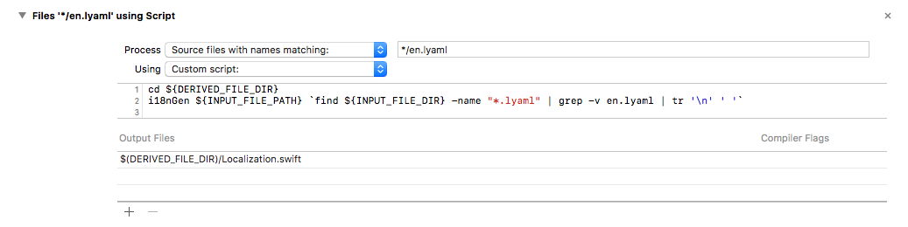
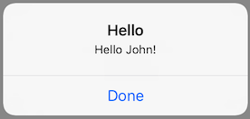
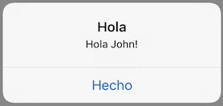
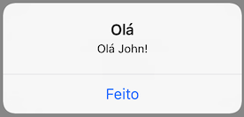

# Mobile i18n Generator

This repository contains the **i18nGen** command line tool that takes *language/localization yaml* files as input and automatically generates Swift and Kotlin code containing the localized strings.

This tool is compatible with `lyaml` files generated by [Transifex](https://www.transifex.com/), and it was originally developed for [HubSpot](https://www.hubspot.com/)'s mobile apps.

## Installation

**i18nGen** requires [Swift 4.2](https://swift.org/download/) and it was tested on **macOS 10.13.6**

 - Clone this repository:
```console
$ git clone git@github.com:fabio914/mobile-i18n.git
```

 - Go to the **mobile-i18n-generator** folder:
```console
$ cd mobile-i18n
```

 - Run the install script:
```console
$ ./install.sh
```

## Usage

```console
$ i18nGen <main language YAML file> [additional language YAML files ...] [-kotlin <kotlin package name>]
```

Example (Swift):
```console
$ i18nGen en.lyaml de.lyaml es.lyaml fr.lyaml ja.lyaml pt-br.lyaml
```

Example (Kotlin):
```console
$ i18nGen en.lyaml de.lyaml es.lyaml fr.lyaml ja.lyaml pt-br.lyaml -kotlin com.organization.localization
```

A `Localization.swift` (or `Localization.kt`) file will be generated if **i18nGen** succeeds.

## Usage with XCode

 - Add an `en.lyaml` file to your project/target (**DO NOT** add this file, or any other `.lyaml` file, to the **Copy Bundle Resources** phase):

```yaml
en:
  hello:
    title: "Hello"
    message: "Hello {{ name }}!"
    done: "Done"
```

 - Add a new **Build Rule** to your XCode project/target:



```sh
cd ${DERIVED_FILE_DIR}
i18nGen ${INPUT_FILE_PATH} `find ${INPUT_FILE_DIR} -name "*.lyaml" | grep -v en.lyaml | tr '\n' ' '`
```

 - Add the `en.lyaml` file to the **Compile Sources** phase:


 - Add additional language files (**DO NOT** add these `.lyaml` files to the **Copy Bundle Resources** or **Compile Sources** phase):

```yaml
es:
  hello:
    title: "Hola"
    message: "Hola {{ name }}!"
    done: "Hecho"
```

```yaml
pt-br:
  hello:
    title: "Olá"
    message: "Olá {{ name }}!"
    done: "Feito"
```

**Remember** to keep these `.lyaml` files all on the same directory in your target/project.

XCode will **only** track changes to the `en.lyaml` file. Remember to clean the project (including your project's derived data) by pressing **⌥⇧⌘K** when modifying any of the other `.lyaml` files or updating the **i18nGen** tool!

 - Build the project.

 - Your strings will be defined under `LocalizedStrings` and you can access them via the `localizedStrings` instance:

```swift
let namespace = localizedStrings.hello
let alert = UIAlertController(title: namespace.title, message: namespace.message(name: "John"), preferredStyle: .alert)
alert.addAction(UIAlertAction(title: namespace.done, style: .default, handler: { _ in }))

present(alert, animated: true, completion: nil)
```

 - Result:







## Usage with Android Studio

**TO-DO**


