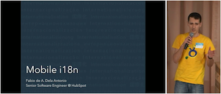

# Mobile i18n Generator

This repository contains the **i18nGen** command line tool that takes *language/localization yaml* files as input and automatically generates Swift and Kotlin code containing the localized strings.

This tool is compatible with `lyaml` files generated by [Transifex](https://www.transifex.com/), and it was originally developed for [HubSpot](https://www.hubspot.com/)'s mobile apps.



Watch the presentation [on YouTube](https://youtu.be/AZkGT_J-VMA).

## Installation

**i18nGen** requires [Swift 5](https://swift.org/download/) and it was tested on **macOS 10.14** and **Ubuntu 18.04**

 - Clone this repository:
```console
$ git clone https://github.com/fabio914/mobile-i18n.git
```

 - Go to the **mobile-i18n-generator** folder:
```console
$ cd mobile-i18n
```

 - Run the install script:
```console
$ ./install.sh
```

or

```console
$ ./installLinux.sh
```

## Usage

```console
$ i18nGen <main language YAML file> [additional language YAML files ...] [output options] [warning options]
```

Examples (Swift):
```console
$ i18nGen en.lyaml de.lyaml es.lyaml fr.lyaml ja.lyaml pt-br.lyaml -swift
```

*Outputs a Swift dictionary, without warnings:* 
```console
$ i18nGen en.lyaml de.lyaml es.lyaml fr.lyaml ja.lyaml pt-br.lyaml -swift-dictionary -w
```

*All warnings:*
```console
$ i18nGen en.lyaml de.lyaml es.lyaml fr.lyaml ja.lyaml pt-br.lyaml -swift -Wall
```

Examples (Kotlin):
```console
$ i18nGen en.lyaml de.lyaml es.lyaml fr.lyaml ja.lyaml pt-br.lyaml -kotlin com.organization.localization
```

*Outputs Kotlin code without static strings:* 
```console
$ i18nGen en.lyaml de.lyaml es.lyaml fr.lyaml ja.lyaml pt-br.lyaml -kotlin-filtered com.organization.localization
```

*All warnings:*
```console
$ i18nGen en.lyaml de.lyaml es.lyaml fr.lyaml ja.lyaml pt-br.lyaml -kotlin com.organization.localization -Wall
```

A `Localization.swift` (or `Localization.kt`) file will be generated if **i18nGen** succeeds.

## Usage with XCode (iOS)

 - Add an `en.lyaml` file to your project/target (**DO NOT** add this file, or any other `.lyaml` file, to the **Copy Bundle Resources** phase):

```yaml
en:
  hello:
    title: "Hello"
    message: "Hello {{ name }}!"
    done: "Done"
```

 - Add a new **Build Rule** to your XCode project/target:


```sh
cd ${DERIVED_FILE_DIR}
i18nGen ${INPUT_FILE_PATH} `find ${INPUT_FILE_DIR} -name "*.lyaml" | grep -v en.lyaml | tr '\n' ' '` -swift
```

 - Add the `en.lyaml` file to the **Compile Sources** phase:


 - Add additional language files (**DO NOT** add these `.lyaml` files to the **Copy Bundle Resources** or **Compile Sources** phase):

```yaml
es:
  hello:
    title: "Hola"
    message: "¡Hola {{ name }}!"
    done: "Hecho"
```

```yaml
pt-br:
  hello:
    title: "Olá"
    message: "Olá {{ name }}!"
    done: "Feito"
```

**Remember** to keep these `.lyaml` files all on the same directory in your target/project.

XCode will **only** track changes to the `en.lyaml` file. Remember to clean the project (including your project's derived data) by pressing **⌥⇧⌘K** when modifying any of the other `.lyaml` files or updating the **i18nGen** tool!

 - Build the project.

 - Your strings will be defined under `LocalizedStrings` and you can access them via the `localizedStrings` instance:

```swift
let namespace = localizedStrings.hello
let alert = UIAlertController(title: namespace.title, message: namespace.message(name: "John"), preferredStyle: .alert)
alert.addAction(UIAlertAction(title: namespace.done, style: .default, handler: { _ in }))

present(alert, animated: true, completion: nil)
```

 - Result:


## Usage with [XCodeGen](https://github.com/yonaskolb/XcodeGen) (iOS)

- Add an `en.lyaml` file to your target:

```yaml
en:
  hello:
    title: "Hello"
    message: "Hello {{ name }}!"
    done: "Done"
```

- Add your `en.lyaml` file to your `project.yml`'s target sources:

```yaml
sources:
  # ...
  - path: "path/to/folder/en.lyaml"
    buildPhase: sources
    createIntermediateGroups: true
```

- Add a new **Build Rule** to your `project.yml`'s target:

```yaml
buildRules:
  # ...
  - name: Localize
    filePattern: "*/en.lyaml"
    script: |
            cd ${DERIVED_FILE_DIR}
            i18nGen ${INPUT_FILE_PATH} `find ${INPUT_FILE_DIR} -name "*.lyaml" | grep -v en.lyaml | tr '\n' ' '` -swift
    outputFiles:
      - $(DERIVED_FILE_DIR)/Localization.swift
```

- Add additional language files (inside the same folder as your `en.lyaml`):

```yaml
es:
  hello:
    title: "Hola"
    message: "¡Hola {{ name }}!"
    done: "Hecho"
```

```yaml
pt-br:
  hello:
    title: "Olá"
    message: "Olá {{ name }}!"
    done: "Feito"
```

- Add the extra language files to your `project.yml` (optional):

```yaml
sources:
  # ...
  - path: "path/to/folder"
    buildPhase: none
    createIntermediateGroups: true
    excludes:
      - "en.lyaml"
```

- Regenerate your XCode project:

```console
$ xcodegen generate
```

- Build your target.

- Your strings will be defined under `LocalizedStrings` and you can access them via the `localizedStrings` instance:

```swift
let namespace = localizedStrings.hello
let alert = UIAlertController(title: namespace.title, message: namespace.message(name: "John"), preferredStyle: .alert)
alert.addAction(UIAlertAction(title: namespace.done, style: .default, handler: { _ in }))

present(alert, animated: true, completion: nil)
```

- Result:


## Usage with Android Studio (Android)

- Add these rules to your root-level `build.gradle` file:

```gradle
apply plugin: 'com.i18n.community.localization'

buildscript {
    // ...
    repositories {
        // ...
        jcenter()
    }

    dependencies {
        // ...
        classpath "com.i18n.community.localization:GradlePlugin:1.0.+"
    }
}
```

- Create a `lang` directory inside your module's root;

- Create an `en.lyaml` file inside that `lang` directory:

```yaml
en:
  hello:
    title: "Hello"
    message: "Hello {{ name }}!"
    done: "Done"
```

 - Create additional language files 

```yaml
es:
  hello:
    title: "Hola"
    message: "¡Hola {{ name }}!"
    done: "Hecho"
```

```yaml
pt-br:
  hello:
    title: "Olá"
    message: "Olá {{ name }}!"
    done: "Feito"
```

- Build the project.

- Your strings will be defined under `LocalizedStrings`:

```kotlin
val namespace = LocalizedStrings.hello

AlertDialog.Builder(this)
    .setTitle(namespace.title)
    .setMessage(namespace.message(name = "John"))
    .setPositiveButton(namespace.done) { _, _ -> }
    .create()
    .show()
```

- Result:


